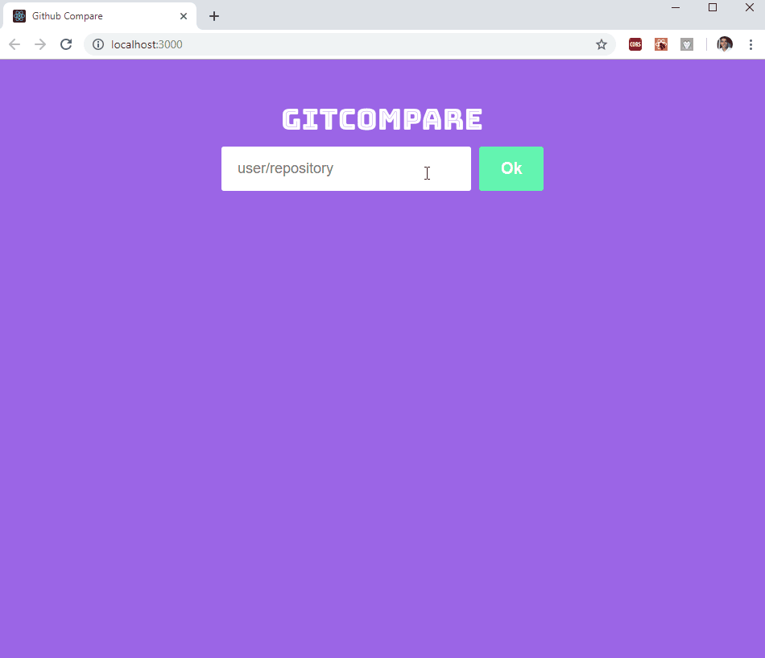

# Git Compare
ReactJs app to compare github repositories 

## Installation

**Yarn:** https://yarnpkg.com/lang/en/docs/install/

Run **yarn** into project folder to get the dependencies

## Features

* Search for github repositories;
* Store results for later (localStorage);
* Update & Delete stored repo's.

